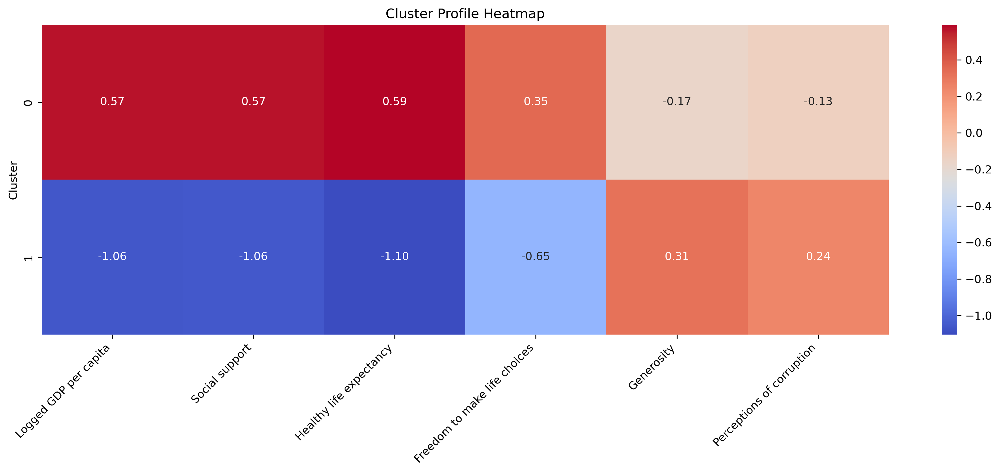

# KMeans Clustering on World Happiness Data

This project uses KMeans clustering to group countries based on happiness-related indicators from the World Happiness dataset. It helps reveal patterns among countries with similar economic, social, and health characteristics.

## 📂 Project Structure


- `Notebook/` – KMeans implementation 
- `Images/` – Saved plot


## ⚙️ Processes Performed 

- Data Preparation and Cleaning
- Exploratory Data Analysis (EDA)
- Model Training
- Model Evaluation
- Diagnostic Plots and Interpretation

## 📊 Dataset

- Source: [Kaggle - World Happiness Report](https://www.kaggle.com/datasets/unsdsn/world-happiness)
- Format: CSV

## 📌 Key Results

- Optimal number of clusters: **K = 2**
- Cluster 0: Higher GDP, health, and freedom
- Cluster 1: Lower socio-economic indicators, higher generosity and trust



## 📚 Libraries Used

- pandas  
- numpy  
- matplotlib  
- seaborn  
- scikit-learn

## 🧪 How to Run

Open the notebook:

```bash
Notebook/kmeans_happiness.ipynb
